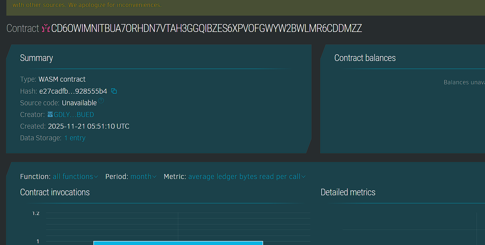

# SecureGuardian Contract

## Project Title
SecureGuardian Contract

## Project Description
SecureGuardian Contract is a smart contract solution designed to securely manage guardianship arrangements for dependents. Built with Soroban smart contracts on the Stellar blockchain, it supports creation of guardianship agreements, recording guardian actions, and transparent lifecycle management ensuring accountability and trust.

## Project Vision
The project seeks to digitize and secure guardianship responsibilities by immutably recording agreements and guardian activities on blockchain. SecureGuardian Contract empowers dependents, guardians, and legal entities with auditable, transparent, and tamper-proof records enhancing compliance and peace of mind.

## Key Features
- Guardianship Agreements: Secure registration of guardian and dependent relationships.
- Action Logs: Guardians record actions and decisions related to dependents.
- Agreement Lifecycle: Manage agreement activation, termination, and tracking.
- Immutable Ledger: All agreements and actions permanently stored on-chain.
- Role Enforcement: Only authorized guardians can create and execute actions.
- Transparent Auditability: Public retrieval of agreements and guardian activity logs.
- Tamper Prevention: Prevents unauthorized actions and modifications.

## Usage Instructions
1. Guardians create agreements specifying responsibilities.
2. Guardians log actions performed pertaining to dependents.
3. Guardians may terminate agreements upon completion or legal changes.
4. Any party can query agreement and action details for insight.

## Future Scope
- Multi-guardian support for shared guardianship models.
- Integration with legal frameworks and court approvals.
- Notifications and alerts for key guardianship events.
- Mobile and web tools for guardians and dependents.
- Enhanced privacy controls with zero-knowledge proofs.
- Cross-jurisdictional compliance and enforcement.

## Technology Stack
- Soroban Rust SDK securing reliable contract operations.
- Stellar blockchain providing immutable decentralized records.
- Cryptographic authentication ensuring identity and access control.

## Contribution
Open to blockchain developers, legal professionals, and caregiver organizations to enrich platform capabilities. Contributions are welcomed through forks and pull requests.

## License
This project is licensed under the MIT License.

### Contract Detail
ID : CD7PKAFZAZ6EF7JNPP4UWGYOMPKTDCXQN4FE3MMXMJ5TPX57A6MM3V3L
